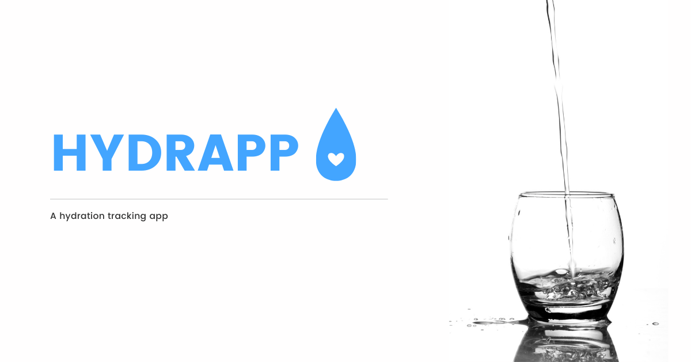

# Hydrapp

A simple web app for tracking your hydration.

## How to use it?

Clone it to your computer, go to the project directory in console and type `npm install`.

## Available scripts

`npm run start` - runs development mode

`npm run build` - runs build process for production

`npm run publish` - runs build process and publish the page using `gh-pages` branch

## Live view

Live: https://bartosz-malecki.github.io/hydrapp/

## Technologies 

      

## Status

